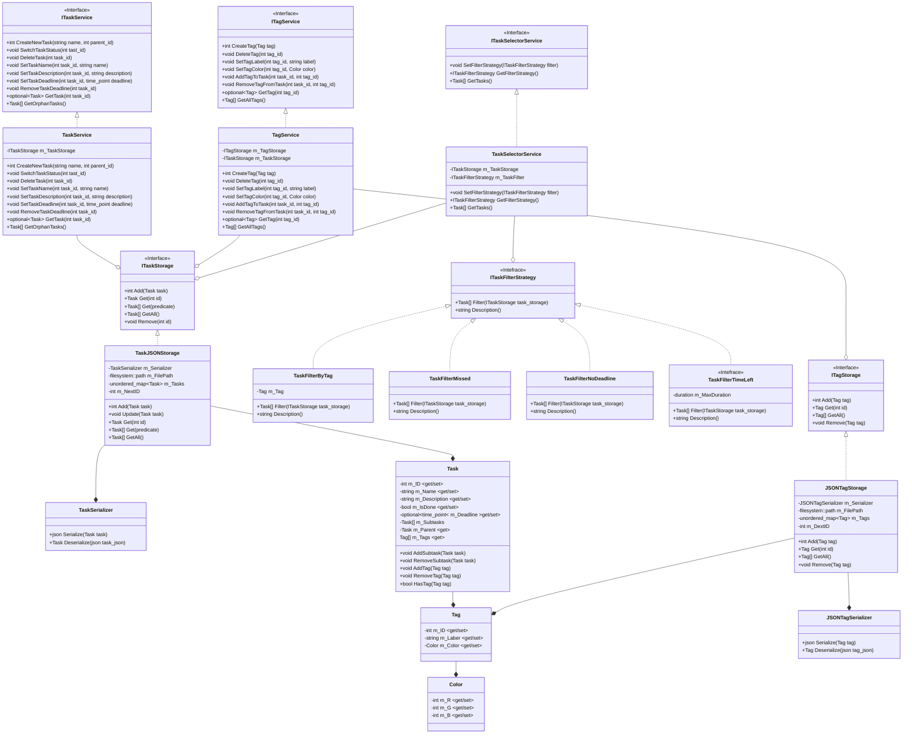

# Task Manager

Простий CLI менеджер завдань для роботи з деревоподібною структурою завдань. В ньому є підтримка тегів, 4 види фільтрації: за тегом, пропущені, без дедлайну, незабаром дедлайн.

## Build & run

Необхідно встановити:

- C++ компілятор (g++, clang, MSVC, etc) з 20 стандартом

- CMake

- nlohmann/json

Build:

```bash
mkdir build
cd build
cmake ..
make
```

Run:

```bash
./build/src/TaskManager
```

Run tests:

```bash
./build/test/TaskManagerTest
```

## Архітектура



## Структура

```
task-manager
├── include
│   ├── bussiness
│   ├── console
│   ├── core
│   └── infrastructure
├── src
│   ├── bussiness
│   ├── console
│   ├── core
│   └── infrastructure
└── test
```

- `include/` містить хедери (.h)

- `src/` містить реалізацію (.cpp)

- `test/` містить unit-тести

- `core/` містить доменні сутності (Color, Tag, Task), базові контракти репозиторіїв

- `bussiness/` містить бізнес-правила (фільтрація тасок)

- `infrastructure/` містить сервіси та реалізації репозиторіїв

- `console/` містить UI (CLI)